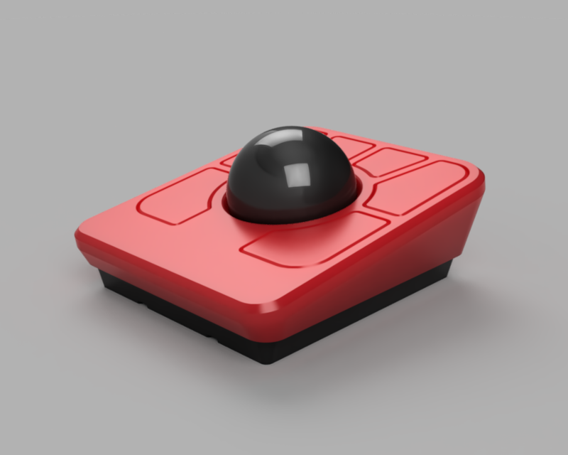

# LT6C 6 Keys Trackball

The LambdaKB LT6C is a re-creation of the [Ploopy Adept](https://ploopy.co/adept-trackball/) PCB and case as an easy to build DIY kit. The main goal was to build it using only off-the-shelf part and components that can be hand soldered relatively easily.

We set out to create a more affordable alternative to the original Adept trackball while retaining all its features, primarily for individuals in regions where purchasing the original kit isn't cost-effective (for example, shipping from the Ploopy store to Europe costs over €35 before import taxes).

## PCB

|             Front             |            Back             |
| :---------------------------: | :-------------------------: |
| [![PCB Front]][PCB Front PNG] | [![PCB Back]][PCB Back PNG] |

[PCB Front]: output/img/lt6c-pcb-top.svg
[PCB Front PNG]: output/img/lt6c-pcb-top.png
[PCB Back]: output/img/lt6c-pcb-bottom.svg
[PCB Back PNG]: output/img/lt6c-pcb-bottom.png

The PCB has been designed in [KiCad EDA 8.0](https://www.kicad.org/) using the [`kicad-lkbd`](https://github.com/lambdakb/kicad-lkbd) libraries.

You can preview the project files using [KiCanvas](https://kicanvas.org/?github=https%3A%2F%2Fgithub.com%2Flambdakb%2Ftrackball-lt6c%2Fblob%2Fmain%2Fpcb%2Flt6c-pcb.kicad_pro) directly in your browser and download the latest fabrication files for JLCPCB from the [latest release](https://github.com/lambdakb/trackball-lt6c/releases/latest/).

The exported schematic is also available under [`output/schematics`](output/schematics/).

### PCB Order

| Parameters                       | Value                  |
| -------------------------------- | ---------------------- |
| Base Material                    | FR4                    |
| Layers                           | 2                      |
| Dimensions                       | 62 × 64.4 mm           |
| PCB Thickness                    | 0.8 mm                 |
| PCB Color [^pcb-color]           | Green                  |
| Silkscreen                       | White                  |
| Surface Finish [^surface-finish] | Lead Free HASL or ENIG |
| Copper Weight                    | 1 oz                   |
| Via Covering                     | Tented                 |
| Min Via Hole Size                | 0.3 mm                 |
| Board Outline Tolerance          | ± 0.2 mm               |

[^pcb-color]: You can select any PCB color you want but manufacturers such as JLCPCB will charge you more for it as the combo 0.8 mm thickness, Lead Free HASL surface finish and alternative board color is pretty uncommon for them to produce.
[^surface-finish]: The "HASL (with lead)" option is extremely discouraged due to the risk of lead poisoning. We strongly recommend paying the premium for the "Lead Free HASL" option.

## Case

|                                                3D Render                                                 |
| :------------------------------------------------------------------------------------------------------: |
|  |

A 3D printed case is available under [`case`](case/), this is a simple modification of the original [Ploopy Adept's case](https://github.com/ploopyco/adept-trackball/tree/master/hardware/mechanicals) that adds clearance for the back of our PCB. No other major modification has been done it.

This includes:

- A pre-cconfigured [`3mf` file](case/lt6c-case.3mf) for Orca Slicer
- Printing instructions
- Individual STL files, STEP file, and the original Fusion 360 project archive

Feel free to modify the case to your liking, but please make sure to respect the original [license](./README.md#license) when doing so.

## BOM

| Part                          | Ref.                                 | Quantity | Remarks                                                                                                                                         |
| ----------------------------- | ------------------------------------ | :------: | ----------------------------------------------------------------------------------------------------------------------------------------------- |
| PCB                           | [LT6C PCB](./README.md#pcb)          |    1     | See [PCB](./README.md#pcb) section on how to order it.                                                                                          |
| 3D Printed Case               | [LT6C Case](./case/README.md)        |    1     | 3D Printed case adapted from the [Adept Trackball case]. Make sure to check its individual [BOM](case/README.md#bom) for the required hardware. |
| 44 mm Trackball               | Any [1.75" Snooker Ball]             |    1     | The trackball ball itself, any 1.75" snooker / billiard ball should work.                                                                       |
| XIAO RP2040 Controller        | [SeeedStudio XIAO RP2040]            |    1     | Main controller for QMK/Vial.                                                                                                                   |
| Micro Switches                | [D2LS-21 SMD Micro Switch]           |    6     | Micro switches for mouse buttons.                                                                                                               |
| PMW3360 Optical Sensor & Lens | [PMW3360DM-T2QU + LM19-LSI]          |    1     | Optical mouse sensor and lens used to detect trackball movement.                                                                                |
| 1.8V DO                       | [TPS76318 Fixed 1.8V LDO (SOT-23-5)] |    1     | Power regulator for optical sensor.                                                                                                             |
| 1uF Capacitor                 | [0805 SMD Ceramic Capacitor]         |    1     | Required by the optical sensor LDO.                                                                                                             |
| 4.7uF Capacitors              | [0805 SMD Ceramic Capacitor]         |    2     | Power filtering capacitor for optical sensor and required LDO.                                                                                  |
| 100nF Capacitors              | [0805 SMD Ceramic Capacitor]         |    1     | Power filtering for the optical sensor.                                                                                                         |
| 10K Ω Resistor                | [0805 SMD Resistor]                  |    1     | Required by the optical sensor.                                                                                                                 |
| 39 Ω Resistor                 | [0805 SMD Resistor]                  |    1     | Required by the optical sensor.                                                                                                                 |

[Adept Trackball case]: https://github.com/ploopyco/adept-trackball/tree/master/hardware/mechanicals
[1.75" Snooker Ball]: https://amzn.eu/d/hGChcvq
[SeeedStudio XIAO RP2040]: https://www.seeedstudio.com/XIAO-RP2040-v1-0-p-5026.html
[D2LS-21 SMD Micro Switch]: https://www.aliexpress.com/item/1005003435671261.html
[PMW3360DM-T2QU + LM19-LSI]: https://www.aliexpress.com/item/4000904265601.html?
[TPS76318 Fixed 1.8V LDO (SOT-23-5)]: https://www.aliexpress.com/item/1005007852956393.html
[0805 SMD Ceramic Capacitor]: https://www.aliexpress.com/item/32812155708.html
[0805 SMD Resistor]: https://www.aliexpress.com/item/32847143167.html

## Firmware

Firmware has been built using the [`vial` fork](https://github.com/vial-kb/vial-qmk) of [QMK](https://qmk.fm).

## Attribution

This project is a complete reimplementation of the [Ploopy Adept trackball](https://ploopy.co/adept-trackball/) PCB using off-the-shelf components that are relatively easy to hand solder.

The provided [3D printed case](#case) is a modification of [the Adept's original case](https://github.com/ploopyco/adept-trackball/tree/master/hardware/mechanicals) with a bit more space at the back to fit the new controller on the PCB. It has otherwise not be modified.

The original concept and design were created by Ploopy, who have licensed it under the [CERN Open Hardware Licence Version 2 – Strongly Reciprocal (CERN-OHL-S-2.0)](https://github.com/ploopyco/adept-trackball/blob/master/LICENSE), which permits adaptations, as demonstrated in this project.

## License

This design is licensed under the [CERN Open Hardware Licence Version 2 – Strongly Reciprocal (CERN-OHL-S-2.0)](https://opensource.org/license/cern-ohl-s).

You are free to use, modify, and distribute this design for any purpose, provided that:

- **Attribution**: Appropriate credit is given, a link to the license is provided, and any modifications are clearly indicated.
- **Reciprocity**: Any derivative works must be released under the same license.

If you are a retailer or business interested in producing or selling this design or related products, I’d love to discuss it! Please feel free to reach out so we can explore potential arrangements.
