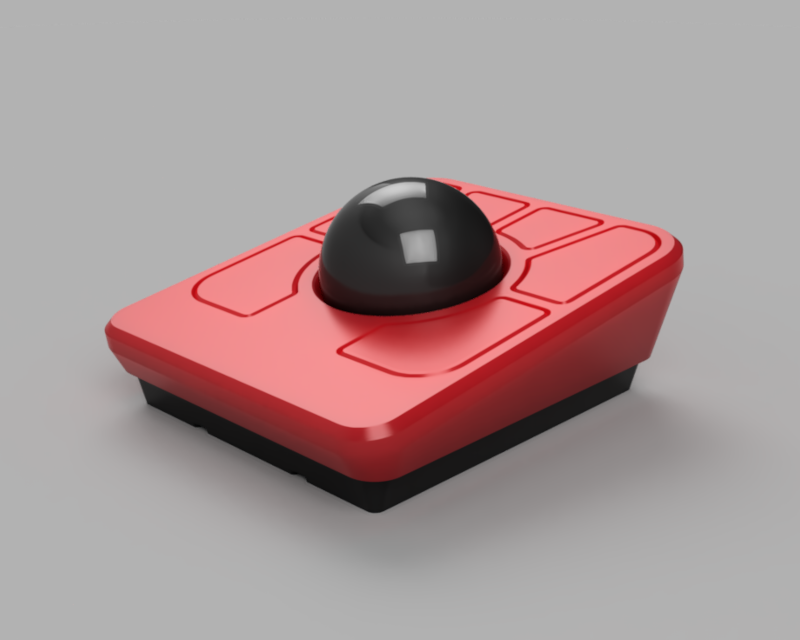
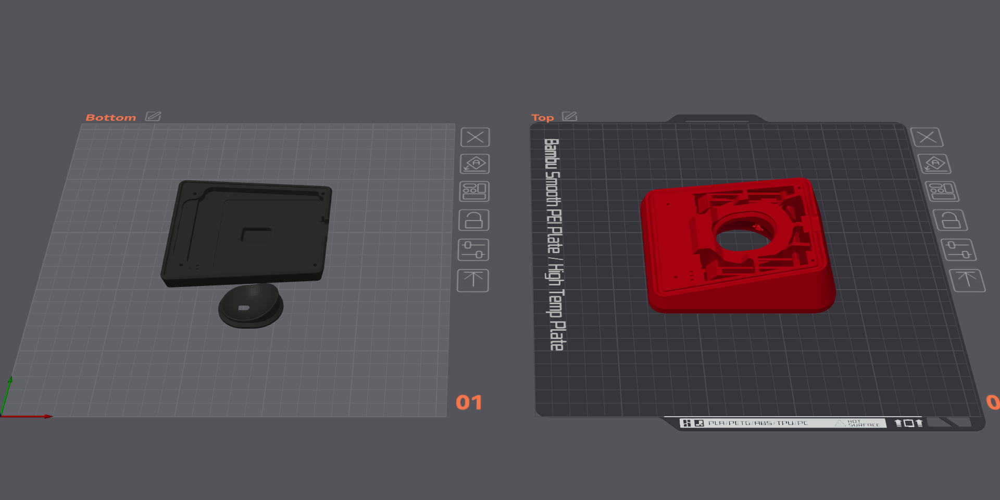

# LT6C 3D Printed Case

## 3D Render

|                                       |                                  |                                    |
| :-----------------------------------: | :------------------------------: | :--------------------------------: |
|  |    |  |
|       |  |  |

This case is a simple modification of the original [Ploopy Adept's case](https://github.com/ploopyco/adept-trackball/tree/master/hardware/mechanicals) that adds clearance for the back of our PCB and some subtle branding.
It also adds the necessary space for M2 heatset insert to be added to the top part to more securely screw together both part.
No other major modification has been done it.

## BOM

| Part                  | Ref.                                                 | Quantity | Remarks                                                                                                |
| --------------------- | ---------------------------------------------------- | :------: | ------------------------------------------------------------------------------------------------------ |
| Top Case              | [STL File](./lt6c-case-top.stl)                      |    1     | Remixed [Ploopy Adept] Top Case for the LT6C PCB.                                                      |
| Bottomm Case          | [STL File](./lt6c-case-bottom.stl)                   |    1     | Remixed [Ploopy Adept] Bottom Case for the LT6C PCB.                                                   |
| Sensor Shroud         | [STL File](./lt6c-case-sensor-shroud.stl)            |    1     | Original [Ploopy Adept] Sensor Shroud.                                                                 |
| Bearing Press         | [STEP File][Ploopy Bit Bearing Press]                |    1     | Bearing Press from the [Ploopy Classic Trackball].                                                     |
| Roller Bearing Dowels | [STEP File][Ploopy Rollber Bearing Dowel]            |    1     | Roller bearing dowels from the [Ploopy Classic Trackball].                                             |
| Case Screws           | [M2 × 6 mm Socket Head Screw (Hex)]                  |    4     | Any M2 hex screw show work from 4 mm to 10 mm in length with a head no bigger than 4.5 mm in diameter. |
| M2 Heatset Inserts    | [CNC Kitchen M2 × 3 Insert] or [Ruthex M2 × 4 Insert] |    4     | Any M2 heatset inserts with an outside insertion diameter of 3.1 mm.                                   |
| Roller Bearings       | [MR63ZZ 3 × 6 × 2.5 mm Bearing]                      |    3     | Sliding surface between the case and the trackball itself.                                             |
| Anti-Slip Feet        | Any                                                  |    4     | Recommended for stability, any silicone or cork adhesive anti-slip feet should work.                   |

[Ploopy Adept]: https://github.com/ploopyco/adept-trackball/
[Ploopy Classic Trackball]: https://github.com/ploopyco/classic-trackball/
[M2 × 6 mm Socket Head Screw (Hex)]: https://www.aliexpress.com/item/4001072025844.html
[CNC Kitchen M2 × 3 Insert]: https://cnckitchen.store/products/heat-set-insert-m2-x-3-100-pieces
[Ruthex M2 × 4 Insert]: https://www.ruthex.de/fr/products/ruthex-gewindeeinsatz-m2-70-stuck-rx-m2x4-messing-gewindebuchsen
[MR63ZZ 3 × 6 × 2.5 mm Bearing]: https://www.aliexpress.com/item/1005001864936060.html
[Ploopy Bit Bearing Press]: https://github.com/ploopyco/classic-trackball/blob/master/hardware/Mechanicals/STEPs/Bit%20Bearing%20Press%20Complete.step
[Ploopy Rollber Bearing Dowel]: https://github.com/ploopyco/classic-trackball/blob/master/hardware/Mechanicals/STEPs/RollerBearingDowel.stp

## Print Profile

The included [`lt6c-case.3mf`](./lt6c-case.3mf) file has been built using Orca Slicer for the Bambu Lab A1 printer with the following settings:

- **Nozzle diameter**: 0.4 mm
- **Layer height**: 0.2 mm
- **Wall Loops**: 2
- **Top Shell Layers**: 5
- **Bottom Shell Layers**: 4
- **Bottom / Top Surface Pattern**: Rectilinear
- **Infill**: 15%
- **Infill Pattern**: Gyroid
- **Infill Overlap**: 25%
- **Seam Position**: Nearest
- **Wall Generator**: Arachne
- **Thick External / Internal Bridges**: YES
- **Brim**: No Brim
- **Recommended Filament**: PLA

Please use the following part orientation for the best results:

## Assembly Guide

Once you have your [PCB](/README.md#pcb) ready and your parts printed, you can start assembling the case. You should be able to follow the [Ploopy Adept Assembly Guide](https://github.com/ploopyco/adept-trackball/wiki/Ploopy-Adept-Trackball-Kit-Assembly) starting from **Step 6**.

A complete build guide of the LT6C is also available at [LambdaKB.dev](https://lambdakb.dev/devices/lt6c/build).

## BTU Mod

A modified version of the top part of the case that accepts 7.5 mm ball transfer unit (built around [MJ310 BTUs][MJ310 BTU]) is also available.

|                                           |                                    |                                      |
| :---------------------------------------: | :--------------------------------: | :----------------------------------: |
|  |  |  |

The source [Fusion 360 project export][Fusion360 Project] already includes this mod as part of its timeline, dedicated [STL][BTU STL File] & [STEP][BTU STEP File] are also available.

### Printing

In order to print this mod properly, you will need to enable Tree Supports and add support enforcers inside the BTU sockets. These have already been configured in the `Top (BTU Mod)` plate of the [`lt6c-case.3mf`](./lt6c-case.3mf) project file.

### Assembly

If you choose to use this mod, you will need **3 × [7.5 mm BTUs][MJ310 BTU]** and should ignore the Roller Bearings, Bearing Press and Dowels from the original BOM.

Assembly is pretty similar to the original case, once you need to install the bearing, just press fit the BTUs inside the designated sockets instead.

[MJ310 BTU]: https://www.aliexpress.com/item/1005005334424631.html
[Fusion360 Project]: ./src/LT6C%20Case%20v20%20(BTU%20Mod).step
[BTU STL File]: ./stl/lt6c-case-top-btu-mod.stl
[BTU STEP File]: ./step/LT6C%20Case%20v20%20(BTU%20Mod).step
